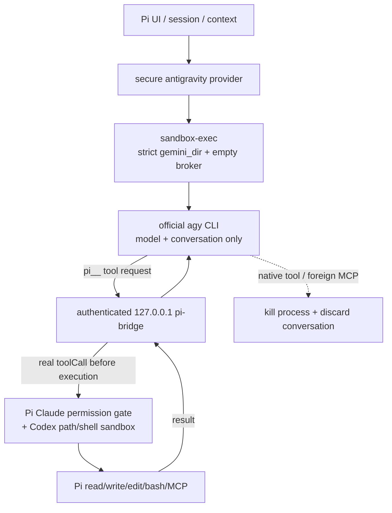

# @liandong00/pi-antigravity-secure

Release notes: [changelog](https://github.com/TianZuo555/pi-extensions/blob/main/packages/pi-antigravity/CHANGELOG.md) · [GitHub releases](https://github.com/TianZuo555/pi-extensions/releases)

Use the official **Google Antigravity** (`agy`) CLI as a model backend inside the [Pi coding agent](https://pi.dev), while Pi remains the only harness allowed to execute filesystem, shell, and MCP tools.

> This fork is not equivalent to the published upstream `@tian.zuo/pi-antigravity@0.9.0`. The upstream release lets agy execute native tools with `--dangerously-skip-permissions`; this branch removes that behavior and fails closed when the secure bridge or OS sandbox is unavailable.

## Highlights

- **Antigravity models in pi's model picker** — `antigravity/gemini-3.7-flash` and friends, with automatic model discovery and effort-correct launches.
- **Persistent stream driver** — ordinary user turns reuse one healthy `agy` process; conversation, model, workspace, agent, mode, and bridge changes recycle it safely.
- **Actionable diagnostics** — `/agy doctor` explains executable selection, checks every candidate and the minimum version, and reports models, driver spawn/recycle counters, bridge revision, conversation database, and display metadata without spending model tokens.
- **Inference-only agy process** — agy runs in an empty per-session broker workspace, never the real project.
- **Strict isolated profile** — no `--dangerously-skip-permissions`, no `--add-dir`; native read/write/shell/URL actions are denied in a dedicated `--gemini_dir`.
- **Mandatory macOS Seatbelt** — every official agy process, including version checks, model discovery, quota checks, and persistent turns, runs with read/write access restricted to the isolated profile and broker. Failure to apply Seatbelt aborts startup.
- **Real Pi tool loop** — agy may call only the authenticated `pi-bridge` MCP server. Pi builtins and `pi-mcp-adapter` tools become real Pi tool calls before execution, so Pi permissions and rendering apply normally.
- **Escape termination** — any agy native tool event or call to another MCP server immediately kills the agy executor and discards its resumable conversation.
- **Skills through Pi** — one `pi__activate_skill` tool returns content for Pi-discovered skills; host file paths are never exposed as a direct-mode fallback.
- **Model quotas** — `/agy-usage` ports agy's `/usage` into the same Refresh/Close menu as `/usage`: weekly and 5-hour remaining bars per model group, refreshed without spending tokens.

## How it works



The bridge deliberately has no direct mode. If its token, loopback server, exclusive profile registration, fail-closed policy, or Seatbelt launch cannot be established, the provider returns an error before a model turn starts.

## Install

This secure fork is currently intended for local-checkout use only; do not install the upstream npm release as a substitute.

```bash
pi -e ./packages/pi-antigravity --model antigravity/gemini-3.7-flash
```

Requires the `agy` CLI installed and logged in (**v1.1.22+**). `AGY_BINARY` is a strict override. Without it, the extension checks both `agy` on `PATH` and the existing VS Code-managed `~/.gemini/bin/agy`, then selects the newest compatible stable version (or highest prerelease if no stable build exists); a `dev`/`HEAD` build is used only when no compatible versioned candidate exists. Successful checks are cached but automatically invalidated when a candidate path or file signature changes. The extension never downloads or updates executables.

## Features

### Skills & MCP bridge

When an Antigravity model is selected, the extension runs a token-authenticated loopback MCP server named `pi-bridge`. Each Pi session gets a separate empty broker directory whose name is a bounded hash of the session id.

agy 1.1.22 documents workspace MCP in `.agents/mcp_config.json`, but does not actually load it into the model tool catalog ([google-antigravity/antigravity-cli#60](https://github.com/google-antigravity/antigravity-cli/issues/60)). The extension therefore registers `pi-bridge` only in the **dedicated** `--gemini_dir` global MCP file. A `0600` lock outside agy's writable profile binds that capability to one Pi PID/session at a time. A second session fails closed instead of replacing the endpoint or token. `/agy unlock` recovers only a dead-owner lock and clears the global MCP capability before removing the lock; it never unlocks a live owner. Concurrent agy sessions are intentionally unsupported until a credential-safe multiplexing design exists.

- **Skills** — one `pi__activate_skill` tool whose JSON-schema enum is the Pi catalog.
- **Pi builtins** — `read`, `write`, `edit`, `bash`, `powershell`, `grep`, `find`, and `ls` are exposed as `pi__*` tools.
- **MCP** — tools supplied by `pi-mcp-adapter` are exposed with the same prefix.

Concurrent sessions do not share registrations because each process points agy at its own broker cwd. The server name and tool prefix can therefore remain stable without global catalog pollution. No active turn, unknown tool, bad token, stale session, or timeout fails closed.

An MCP call flows like this:

1. agy calls `pi__<name>` — the bridge routes the call into its live turn.
2. pi ends the assistant message with a tool call for the **real** pi tool — it renders as a normal card and goes through pi's normal permissions and hooks.
3. pi executes it, and the result is handed back to the still-running agy turn.

Pi session-mutating extension tools remain hidden. Every agy native tool is forbidden even when it is read-only; observing one terminates the process instead of replaying its result.

### Skill passing

Your pi skills work inside agy turns:

- All Pi-discovered skills, including project skills, are served through `pi__activate_skill`.
- There is no direct path catalog or native agy skill fallback.
- Skills respect pi's own config: `--no-skills`, `pi config` toggles, `/reload`. Skills marked `disable-model-invocation` are skipped.

### Background tasks (`/agy-tasks`)

This legacy diagnostic should remain empty in the secure architecture because native agy commands are forbidden. Any discovered native background task is a security regression, not a supported execution path.

```text
■ 1 agy background task • /agy-tasks to view
```

The dashboard lists newest tasks first with pid and status: `enter` opens a live, scrollable log view, `x` stops it (whole process group), `r` forces a rescan, esc closes. Task state and open logs refresh automatically. Closing pi automatically stops tasks whose processes are directly tied to their logs; heuristic orphan matches remain available for an explicit stop, avoiding accidental termination of unrelated processes. Non-interactive: `/agy-tasks stop <task-id>|all`.

### Artifacts (`/agy-artifacts`)

This bounded browser remains for conversation diagnostics, but native agy artifact creation is not an allowed project-write path. Real project files must be created by Pi tools through the bridge.

```text
◆ 1 agy artifact • /agy-artifacts to view
```

The dashboard shows name, type, size, and origin (`conversation`, `generated`, or `uploaded`). Direct files under the conversation root are included; `.system_generated`, `scratch`, metadata sidecars, directories, and symlinks are excluded. On markdown, press enter/`v` for a bounded (256 KiB), fatal-UTF-8, read-only preview with exact checklist counts when the complete file was read; esc returns to the list. Press `o` to open a file with the system default app. Non-interactive: `/agy-artifacts open <name>`.

### Model quotas (`/agy-usage`)

agy's interactive `/usage` (alias `/quota`) is a TUI-only slash command — there is no `agy usage` subcommand. `/agy-usage` expands the same slash command in print mode (`agy --print /usage --output-format json`), which returns structured quota groups and reports zero tokens.

The menu matches `/usage`: per-group 5-hour and weekly remaining bars with clock-style reset times. Refresh re-queries; Close dismisses. Print/RPC modes print the same numbers as a notification.

```text
Gemini Models
  5h limit:         [████████████████████] 98% left · resets 19:53

  Weekly limit:     [███████████████████░] 97% left · resets 09:10 on 4 Sep

Claude and GPT models
  5h limit:         [████████████████████] 100% left · resets 20:08

  Weekly limit:     [████████████████████] 100% left · resets 15:08 on 4 Sep
```

## Commands

| Command | What it does |
| --- | --- |
| `/agy` | Conversation title/status (id, model, turns, process, native context) |
| `/agy reset` | Drop the agy conversation and driver; next turn starts fresh |
| `/agy models` | Re-discover models and re-register the provider |
| `/agy agents` | List configured custom agy agents without inference |
| `/agy doctor` | Diagnose all binary candidates/selection, models, driver spawn/recycle counters, bridge, and conversation state |
| `/agy-tasks` | Background-task dashboard (`stop <task-id> | all` for scripts) |
| `/agy-artifacts` | Artifact browser (`open <name>` for scripts) |
| `/agy-usage` | Model quotas (weekly and 5-hour remaining per group) |

## Configuration flags

| Flag | Effect |
| --- | --- |
| `PI_ANTIGRAVITY_PI_TOOL_BRIDGE=0` | Disable the bridge and therefore disable this provider; no insecure fallback is attempted. |
| `PI_ANTIGRAVITY_GEMINI_DIR=/absolute/path` | Override the dedicated isolated profile. Defaults to `~/.pi/antigravity-gemini`. |
| `PI_ANTIGRAVITY_DRIVER=0` | Operational rollback: spawn one `agy --print` process per logical turn. |
| `PI_ANTIGRAVITY_AGENT=<name>` | Select a custom agy agent. Empty, control-character-containing, and overlong values are rejected before spawn. |
| `PI_ANTIGRAVITY_MODE=plan\|accept-edits` | Select agy's stable CLI execution mode. Other values fail before spawn. |
| `AGY_BINARY=/path/to/agy` | Strictly use a specific agy binary; no fallback if it fails. |
| `AGY_TURN_TIMEOUT_MS=600000` | Pi-owned overall budget per active agy turn. Persistent mode intentionally does not pass `--print-timeout`. |
| `AGY_STALL_TIMEOUT_MS=120000` | Kill the turn when the stream produces no bytes for this long and retry by resuming the conversation. `0` disables the watchdog. |
| `AGY_TOOL_STALL_TIMEOUT_MS=300000` | Stall budget while a tool step is ACTIVE — a quiet foreground tool is legitimate, so silence inside a tool gets a longer leash. |
| `AGY_STALL_RETRY_BACKOFF_MS=3000` | Pause before each stall retry. Stalls retry at most twice, rendered as a collapsed "agy stream stalled … restarting the turn" thinking line. |

## Good to know

- **Permissions:** `--dangerously-skip-permissions` is never passed. The isolated profile uses `toolPermission: request-review`, allows only `mcp(pi-bridge/*)`, and denies native filesystem, shell, URL, and unsandboxed actions. `strict` is intentionally not used because agy headless mode soft-denies even allowlisted MCP calls under that mode. Unknown actions still default to Ask and fail closed without an interactive UI. The user's ordinary `~/.gemini` settings are not read or modified.
- **OS boundary:** macOS `sandbox-exec` is mandatory for every agy invocation. The process receives a credential-stripped environment and can read/write only its isolated profile and broker plus required system files; network egress and local loopback binding remain available for the official service and MCP bridge.
- **Conversation memory:** lives on agy's side and is reused across turns. The native conversation id and cumulative usage baseline are persisted as branch-local Pi state, so reloading or resuming the same Pi session continues the exact compacted agy conversation. Forks receive a new Pi session id and branch/model/project changes cannot rewind agy's mutable history, so those start fresh from Pi's active summary plus a bounded recent-history tail. A missing persisted agy conversation falls back the same way. `/agy reset` writes a durable reset marker and intentionally starts with no restored history.
- **Thinking level** maps to `agy --effort`: low/minimal → `low`, medium → `medium`, high and above → `high`. Discovery retains each model's supported variants; an unsupported request falls back to that model's discovered default (for example Gemini `high`, GPT-OSS `medium`) instead of launching an invalid normalized model id.
- **Context ownership:** agy governs its real context with a ~200k working window and a 185k safety cap, compacting and persisting the native conversation itself. Models advertise a 1M **Pi scheduling window** so Pi does not summarize first at ~168.6k; this value is not a claim about agy's raw capacity. `/agy` reports the latest observed native footprint. agy's terminal counters accumulate over an entire resumed conversation, while the provider reports the latest response step to Pi.
- **Native compaction display:** agy's documented stream-json protocol does not expose the exact compaction-boundary event used by its TUI. The extension conservatively detects a high-context collapse from response-step input plus cache-read usage and appends a durable `agy compacted context · ~178k → ~36k` divider. Ordinary cache/phase variation is filtered by strict minimum-size, reclaimed-token, and ratio thresholds.
- **Pi compaction fallback:** manual `/compact`, overflow recovery, branch summaries, or eventual Pi scheduling run in disposable agy processes and conversations. The active persistent driver therefore contains only real user prompts, not Pi's serialized `<conversation>…</conversation>` summary requests. These fallback summaries report zero usage because agy is subscription-billed.
- **Driver deadlines:** `agy --print-timeout` is deliberately omitted from persistent mode. agy 1.1.22 can remain alive yet stop producing later results after that process-wide budget elapses. Pi arms overall and inactivity watchdogs only while a user event is active and leaves no timer running while the driver is idle.
- **Driver recycling:** selected binary path/version, workspace, model, resolved effort, custom agent, execution mode, and canonical bridge catalog revision form the process fingerprint. Changes recycle between turns and resume the branch-owned conversation; a pending bridged Pi tool call is never interrupted. `/agy doctor` reports total spawns/respawns, submitted and reused turns, recycle count, current-process turns, and per-cause recycle counters, making accidental per-turn churn visible. Leaving Antigravity closes the driver before bridge teardown.
- **Thinking display:** substantive agy reasoning keeps one collapsed `Thought for …` row per logical turn rather than repeating before every tool phase. Tiny token-only planner/tool traces that native agy does not render as a thought row are suppressed.
- **Cost display** uses model-specific public API reference prices for Gemini and Claude (agy is subscription-billed); open or unknown models stay at zero rather than borrowing another model's price. Override per model in `~/.pi/agent/models.json` under `providers.antigravity.modelOverrides`.
- The print interface is text-only; images in context are replaced by an omission note. Model discovery caches live lists for 24h; fallback snapshots (discovery failed or timed out) expire after 5 minutes so live discovery is retried promptly.
- Conversation metadata from the dedicated profile's `antigravity-cli/cache/conversation_metadata.json` enriches `/agy` with a title/steps/update time only. It is bounded, tolerant, and never controls restore; the readable conversation `.db` plus agy's runtime response remain authoritative.
- Hub/Connect RPC, `agentapi`, embedded webviews, passive editor context, executable auto-updates, arbitrary global-conversation switching, and inline accept/reject diffs are intentionally unsupported private/unsafe surfaces from the VS Code extension.
- If an older globally installed copy exists, remove it first: `pi remove npm:@tian.zuo/pi-antigravity`.

## Development

```bash
pnpm --filter @liandong00/pi-antigravity-secure run check
pnpm --filter @liandong00/pi-antigravity-secure test
```

Reference: [Pi-cursor-sdk](https://github.com/fitchmultz/pi-cursor-sdk)
